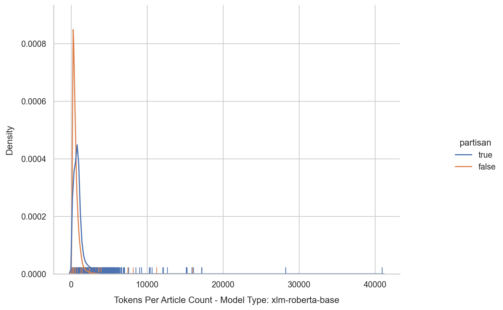

# Dutch language experiments with Multi-lingual Transformer models

## Introduction

While the majority of current Transformer models is focused on English (or a small set of multiple languages) a few Transformer models are truly multi-lingual as for example multi-lingual BERT (I'll further call this MBERT ;-) ), multi-lingual DistilBERT and XLM-RoBERTa. Recently some more Transformer models became available that support a large number of languages (mT5 and ByT5).

As my own native language is Dutch and not English I already had the idea for a while to try out some of these models on a Dutch language dataset. I would like to see what they are capable of doing .. or not. 

Recently I came accross a Dutch news articles dataset which contained for each article labels for whether or not the article was partisan. I also noticed that to my best knowledge no existing work with that dataset and Transformer models was available...so it was time to start experimenting.

All code was created based on Tensorflow and the Huggingface Transformers Library. All models were trained on Google Colab Pro TPUv2 runtimes.

This repository contains code for the following experiments:
- Basic Exploratory Data Analysis
- Train and evaluate the performance of MBERT, DistilMBERT and XLM-RoBERTa as classifiers of Dutch partisan news articles.
- Pre-training MBERT, DistilMBERT and XLM-RoBERTa Masked LM model on the DPGNews Dataset. After that again train and evaluate those models as classifiers of Dutch partisan news articles. What is the difference between 'pre-training and finetuning' and just 'finetuning'?
- Using the default MBERT and XLM-RoBERTa models (without any pretraining or finetuning...) as feature extractors and perform classification with SVM.
- Train and evaluate the performance of mT5 and ByT5 models as classifiers.

Note! If anyone is aware of more multi-lingual models that support Dutch and you would like me to add those...put in a request through an Issue.

## Dataset

The dataset used in my experiment is the [DpgMedia2019: A Dutch News Dataset for Partisanship Detection](https://github.com/dpgmedia/partisan-news2019) dataset.
It contains various parts but the main part I use is a set of about 104K news articles. For each article there is a label 'partisan' stating whether the article is partisan or not (True/False). The amount of partisan / non-partisan articles is roughly balanced.

The dataset was created by the authors with the aim to contribute to for example create a partisan news detector. In the python code used in the experiments the specific dataset files are downloaded automatically. Checkout the github and paper for more information about the dataset and how it whas constructed. See the References for the information.

NOTE !! As of January 2023 not all files are available anymore in the dataset. If you require the files than download them from the [Kaggle Dataset](https://www.kaggle.com/datasets/rsmits/dpgmedia2019).

## Fine-tuning Multi-Lingual BERT, DistilBERT and XLM-RoBERTa

The first part of my experiments was just fine-tuning a default (with the default model-weights as available at Huggingface) MBERT, DistilMBERT and XLM-RoBERTa model to act as a classifier for the partisan news articles.

The python file 'train_mbert_xlmroberta.py' contains all the code to download and process the data. The training is performed based on 3 different rounds with each round containing a full 5 fold stratified Cross Validation training run. The average validation score is determined by taking the mean of the validation accuracy across all 15 trained models.

Training was performed on Google Colab Pro TPUv2 hardware. With a batch_size of 64, learning rate of 0.00002, 3 epochs and the maximum token input length of 512 the training process for all 3 rounds with 5 fold CV's could be completed within about 6 to 7 hours.

For MBERT, DistilMBERT and XLM-RoBERTa I performed this process on 2 different model setup's:
- For each model I used the default Huggingface Transformers SequenceClassification Models
- For each model I used the the BaseModel (TFBertModel / TFDistilBertModel / TFRobertaModel) and added a custom classification head.

The achieved performance can be seen in below table. XLM-RoBERTa scores slightly higher than MBERT...but with scores around 95-96% all models are excellent classifiers.

| Transformer Model Type and Architecture | Average Validation Accuracy (%) Score |
|:---------------|----------------:|
| MBERT Standard Sequence Classification Model | 95.33 |
| MBERT Custom Sequence Classification Model | 95.20 |
| XLM-RoBERTa Standard Sequence Classification Model | 95.87 |
| XLM-RoBERTa Custom Sequence Classification Model | 96.20  |
| DistilMBERT Standard Sequence Classification Model | 94.74 |
| DistilMBERT Custom Sequence Classification Model | 94.86  |

## Pre-training and Fine-tuning Multi-Lingual BERT, DistilBERT and XLM-RoBERTa

The second part of my experiments was first pretraining the models on the DPGNews Dataset. With pre-training with Masked Language Modelling the models are able to train on specifically the text data that is provided to them. The general idea about pre-training is that the models can be learned more domain specific. When fine-tuned next on a task such as classification they should be able to achieve a slightly higher accuracy.

The pre-training was performed with the Python script file 'mlm_pretrain_mbert_xlmroberta.py'. The parameters as set in the script file were used to perform the pre-training. Changing various parameters might lead to further improving performance.

After the pre-training was finished the exact same process for the fine-tuning was used as described above.

For both MBERT, DistilMBERT and XLM-RoBERTa I performed this process on 2 different model setup's:
- For each model I used the default Huggingface Transformers SequenceClassification Models
- For each model I used the the BaseModel (TFBertModel / TFDistilBertModel / TFRobertaModel) and added a custom classification head.

Both XLM-RoBERTa and MBERT score slightly higher when first pre-trained and than fine-tuned compared to only being fine-tuned. The accuracy improvement is about 0.1% to little over 0.2% dependent on the specific model and architecture used. While the achieved accuracy for DistilMBERT is lower than that of XLM-RoBERTa and MBERT it is interresting to note that DistilMBERT benefits more from the pre-training with an accuracy improvement of about 0.3% to 0.4%.

| Transformer Model Type and Architecture | Average Validation Accuracy (%) Score |
|:---------------|----------------:|
| MBERT Standard Sequence Classification Model | 95.54 |
| MBERT Custom Sequence Classification Model | 95.46 |
| XLM-RoBERTa Standard Sequence Classification Model | 96.09 |
| XLM-RoBERTa Custom Sequence Classification Model | 96.27  |
| DistilMBERT Standard Sequence Classification Model | 95.23 |
| DistilMBERT Custom Sequence Classification Model | 95.17  |

## Multi-Lingual BERT and XLM-RoBERTa Feature Extractors and Support Vector Machine as classifier

In the third part of my experiments I use MBERT and XLM-RoBERTa as feature extractors. The models are not finetuned on the DPGNews dataset. They are just used - with the default model weights - to generate feature vectors. The models are modified so that the weights of the last hidden state layer can be used as those feature vectors.

The feature vectors are then used to fit a LinearSVC (Support Vector Machine) model. For this we again perform 3 rounds of 5 Fold Cross Validation training. The average accuracy of classification is based on those 3 rounds with 5 Fold CV.

The python script to run for the feature extraction + SVM classification is 'svm_mbert_xlmroberta.py'. The table below shows the average accuracy achieved with the settings as set in the script. Though the accuracy achieved is lower than when finetuning the Transformers models it is still a very nice score considering we extracted feature vectors from 'default' models and used a rather 'classical' (but still very usable ..) SVM classifier. Also the feature extraction + SVM classification ran in approximately 1 hour compared to at least 6 to 7 hours for fine-tuning the Transformer models.

| Transformer Model Type and Architecture | Average Validation Accuracy (%) Score |
|:---------------|----------------:|
| MBERT Feature Extraction Model | 86.27 |
| XLM-RoBERTa Feature Extraction Model | 88.17 |

## Fine-tuning mT5 and ByT5

The last part of my experiments was just fine-tuning a default (with the default model-weights as available at Huggingface) mT5 and ByT5 model to act as a classifier for the partisan news articles. For both model architectures I used the 'small' and 'base' variants.

With mT5 and ByT5 being generative models they don't predict a label in a Dense layer such as in XLM-RoBERTa. We can however have them learn to generate a label.
In the dataset the labels are represented as either True or False. For mT5 and ByT5 we replace these by the following labels to be generated.
- True ==> 'politiek'
- False ==> 'neutraal'

This way we can use the mT5 and ByT5 models as 'classifiers'.

The python file 'train_mt5_byt5.py' contains all the code to download and process the data. The training is performed based on 3 different rounds with each round containing a full 5 fold stratified Cross Validation training run. Because of the available hardware and the increased runtimes for training (compared to MBERT and XLM-RoBERTa...) these models I trained between 2 to 4 folds in each session. The average validation score is determined by taking the mean of the validation accuracy across all 15 trained models. The python code contains a custom metric (T5_Accuracy) to show the actual accuracy of the models.

! Pay attention to setting the correct 'model_type' and accompanying 'MAX_LABEL_LEN'.

Training was performed on Kaggle TPUv3 hardware. With a batch_size of 32, learning rate of 0.00002, 10 epochs and the maximum token input length of 512 the training process for all 3 rounds with 5 fold CV's could be completed within multiple sessions of maximum 9 hours (Kaggle has a fixed session limit of 9 hours for notebooks).

The achieved performance can be seen in below table. mT5 scores higher than ByT5 but this should be no surprise as mT5 uses tokens which can represent parts of a word or even full words and ByT5 uses tokens which respresent single characters. With mT5 being able to use more of the available input text it should be easier to learn the patterns.

| Transformer Model Type | Average Validation Accuracy (%) Score |
|:---------------|----------------:|
| mT5 - Small | 86.85 |
| mT5 - Base | 91.60 |
| ByT5 - Small | 74.93 |
| ByT5 - Base | 85.18  |

## Exploratory Data Analysis

The python script 'eda.py' performs a simple Exploratory Data Analysis of the used dataset when run. The next image shows a distribution plot of the count of sentences per news article separated by partisan lable.


The next image shows a distribution plot of the count of individual words per news article separated by partisan lable. While there are some extreme outliers the majority of articles has less than 1000 - 1500 words per article.


The used Multilingual Transformer models have a maximum input size length of 512 tokens. Each news article will be tokenized and any sequence of tokens longer then 512 tokens will be truncated. While this process will lead to some loss of information I will still use it this way to have a generic approach accross all models. 

If we compare this to the pre-transformers way of NLP we would also remove stop words, remove punctuation, perform stemming or lemmatization. So while in a different way we would also lose information. 

The following distribution plot shows the token count (without truncation...) per news article separated by partisan lable. This will give an impression of the amount of information lost when truncation will be performed. The tokenization count is based on the tokenizer as is used for the 'xlm-roberta' model.



## References

```
@misc{1908.02322,
  Author = {Chia-Lun Yeh and Babak Loni and Mariëlle Hendriks and Henrike Reinhardt and Anne Schuth},
  Title = {DpgMedia2019: A Dutch News Dataset for Partisanship Detection},
  Year = {2019},
  Eprint = {arXiv:1908.02322},
}
```